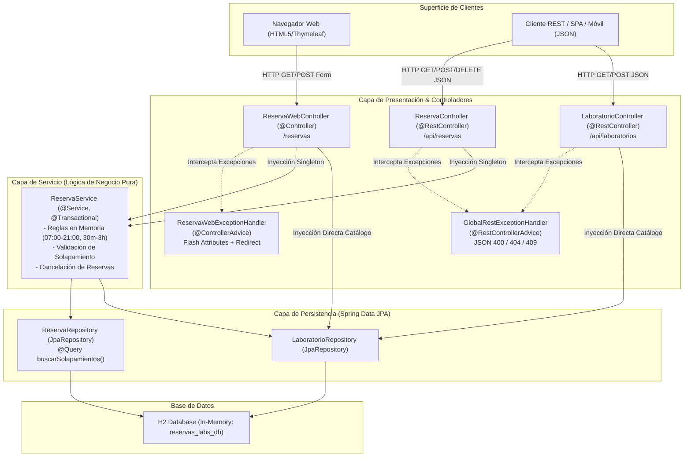

# Post-contenido — Unidad 5: Integración en Aplicaciones Web
## Sistema de Reservas de Laboratorios (Spring Boot 3.2, Java 17, H2, Thymeleaf)

**Autor:** Reyes  
**Curso:** Unidad 5 — Arquitectura en Capas y MVC + REST  
**Tecnologías:** Java 17, Spring Boot 3.2.3, Spring Data JPA, Hibernate, H2 Database, Thymeleaf, Lombok, Jakarta Validation, JUnit 5, Mockito, MockMvc.

---

## 1. Descripción del Proyecto

El **Sistema de Reservas de Laboratorios** es una solución empresarial diseñada bajo una **Arquitectura en Capas Limpia**, que integra simultáneamente dos superficies de interacción:
1. **API RESTful:** Diseñada para consumo por clientes externos, SPAs o aplicaciones móviles (retorna respuestas JSON con códigos HTTP semánticos).
2. **Aplicación Web MVC (Thymeleaf):** Interfaz gráfica interactiva para usuarios finales basada en renderizado del lado del servidor (SSR) con gestión de atributos flash y retroalimentación visual en tiempo real.

Ambas interfaces comparten la misma **Capa de Servicio de Dominio** (`ReservaService`), garantizando coherencia absoluta en la aplicación de las reglas de negocio, integridad de datos y control de concurrencia.

---

## 2. Diagrama de Arquitectura del Sistema



---

## 3. Instrucciones de Compilación y Ejecución

### Requisitos Previos
* **Java Development Kit (JDK):** Versión 17 o superior.
* **Apache Maven:** Versión 3.8 o superior.

### Comandos de Ejecución

1. **Limpiar y compilar el proyecto ejecutando la suite completa de pruebas:**
   ```bash
   mvn clean test
   ```

2. **Empaquetar el archivo ejecutable `.jar`:**
   ```bash
   mvn clean package
   ```

3. **Iniciar el servidor de desarrollo Spring Boot:**
   ```bash
   mvn spring-boot:run
   ```

### Accesos Disponibles
* **Interfaz Web MVC (Thymeleaf):** [http://localhost:8080/reservas](http://localhost:8080/reservas)
* **Formulario de Nueva Reserva:** [http://localhost:8080/reservas/nueva](http://localhost:8080/reservas/nueva)
* **Consola H2 Database:** [http://localhost:8080/h2-console](http://localhost:8080/h2-console)
  * **JDBC URL:** `jdbc:h2:mem:reservas_labs_db`
  * **User Name:** `sa`
  * **Password:** *(en blanco)*

---

## 4. Catálogo de Rutas y Endpoints

### A. Endpoints de la API REST (`/api`)

| Método | Endpoint | Request Body | Códigos HTTP | Descripción |
| :--- | :--- | :--- | :--- | :--- |
| `GET` | `/api/laboratorios` | Ninguno | `200 OK` | Obtiene el catálogo completo de laboratorios disponibles. |
| `GET` | `/api/laboratorios/{id}` | Ninguno | `200 OK`, `404 Not Found` | Obtiene el detalle de un laboratorio por ID. |
| `POST` | `/api/laboratorios` | JSON `Laboratorio` | `201 Created`, `400 Bad Request` | Registra un nuevo laboratorio en el catálogo. |
| `GET` | `/api/reservas` | Ninguno | `200 OK` | Lista todas las reservas registradas. |
| `GET` | `/api/reservas/{id}` | Ninguno | `200 OK`, `404 Not Found` | Obtiene los datos detallados de una reserva por ID. |
| `GET` | `/api/reservas/laboratorio/{id}` | Ninguno | `200 OK`, `404 Not Found` | Lista todas las reservas asociadas a un laboratorio específico. |
| `POST` | `/api/reservas` | JSON `Reserva` | `201 Created`, `400 Bad Request`, `404 Not Found`, `409 Conflict` | Crea una reserva validando horario, duración y solapamiento. |
| `DELETE` | `/api/reservas/{id}` | Ninguno | `204 No Content`, `404 Not Found`, `409 Conflict` | Cancela una reserva existente si aún no ha iniciado. |

### B. Rutas de la Interfaz Web MVC Thymeleaf (`/reservas`)

| Método | Ruta | Parámetros / Modelo | Vista Retornada | Comportamiento |
| :--- | :--- | :--- | :--- | :--- |
| `GET` | `/reservas` | `reservas`, `laboratorios` | `reservas/lista` | Renderiza la tabla de reservas con badges de estado y botones de acción. |
| `GET` | `/reservas/nueva` | `reserva`, `laboratorios` | `reservas/nueva` | Renderiza el formulario de alta con selectores y reglas de negocio. |
| `POST` | `/reservas` | Formulario `@ModelAttribute Reserva` | `redirect:/reservas` | Invoca `reservaService.crear()`. Redirige con flash attribute `mensaje` o redirige a `/reservas/nueva` con `error` en caso de conflicto. |
| `POST` | `/reservas/{id}/cancelar` | `@PathVariable Long id` | `redirect:/reservas` | Invoca `reservaService.cancelar(id)`. Redirige con mensaje flash de éxito o error. |

---

## 5. Justificación Exhaustiva de los 4 Puntos de Decisión de Diseño

### Punto 1: Ubicación y Estrategia de la Validación de Solapamiento
* **Problema a Resolver:** Determinar si un laboratorio ya se encuentra ocupado en un rango temporal $(I_1, F_1)$ al solicitar una nueva reserva $(I_2, F_2)$. Dos intervalos se solapan si y solo si:
  $$\text{Solapamiento} \iff I_{\text{existente}} < F_{\text{nueva}} \land F_{\text{existente}} > I_{\text{nueva}}$$
* **Filtrado Eficiente en BD (JPQL / SQL):** En lugar de cargar todas las reservas históricas de la base de datos a la memoria de la JVM ($O(N)$ en memoria RAM y saturación de la red), la consulta JPQL `buscarSolapamientos` delega el filtrado al motor relacional:
  ```java
  @Query("""
      SELECT r FROM Reserva r
      WHERE r.laboratorio.id = :laboratorioId
        AND r.estado <> com.universidad.reservaslabs.model.EstadoReserva.CANCELADA
        AND r.inicio < :fin
        AND r.fin > :inicio
      """)
  List<Reserva> buscarSolapamientos(@Param("laboratorioId") Long laboratorioId,
                                    @Param("inicio") LocalDateTime inicio,
                                    @Param("fin") LocalDateTime fin);
  ```
  La base de datos utiliza índices B-Tree sobre `laboratorio_id` e `inicio`/`fin`, retornando únicamente $O(K)$ registros conflictivos.
* **Decisión en la Capa de Servicio:** Aunque la consulta se ejecuta en la BD, la **decisión de negocio** (evaluar si la lista no está vacía y lanzar `ReservaConflictException("El laboratorio X ya tiene una reserva en ese horario")`) se ejecuta dentro de `ReservaService` bajo la anotación `@Transactional`.
* **Riesgo de llamar al Repository directo desde el Controller:** Si el controlador invocara directamente al repositorio, se rompería el principio de separación de responsabilidades, la lógica de validación quedaría dispersa y duplicada entre `ReservaController` y `ReservaWebController`, y se perdería el control transaccional de Spring.

---

### Punto 2: Separación de Reglas con y sin Apoyo del Repository
* **Reglas Validadas en Memoria Pura (Sin I/O):**
  * Horario permitido de apertura institucional: `07:00` a `21:00`.
  * Rango de duración: mínimo `30 minutos`, máximo `3 horas`.
  * Coherencia cronológica: `fin.isAfter(inicio)` y mismo día calendario (`inicio.toLocalDate().isEqual(fin.toLocalDate())`).
  * **Justificación:** Estas validaciones dependen **únicamente** de los atributos intrínsecos de la solicitud actual. Se ejecutan en $O(1)$ a nivel de CPU mediante `validarHorarioYDuracion()`, evitando abrir conexiones a base de datos o ejecutar transacciones innecesarias si los datos de entrada violan las reglas básicas.
* **Reglas con Apoyo del Repository:**
  * Existencia del `Laboratorio` asociado en la base de datos.
  * Comprobación de solapamientos con reservas concurrentes en estado no cancelado.
  * **Justificación:** Requieren contrastar el estado de la solicitud contra el estado compartido y persistente del sistema, garantizando atomicidad y consistencia ACID.

---

### Punto 3: Compartir la Capa de Servicio entre REST y MVC (Thymeleaf)
* **Arquitectura de Única Fuente de Verdad (Single Source of Truth):**
  Tanto `ReservaController` (REST) como `ReservaWebController` (MVC) reciben por inyección de dependencias el **mismo bean singleton** `ReservaService`.
* **Beneficios:**
  1. **Cero Duplicación de Lógica (DRY):** Las políticas de negocio, validaciones de franjas y transaccionalidad residen en un único componente de servicio.
  2. **Evolución Sostenible:** Cualquier ajuste a las políticas institucionales (por ejemplo, extender el horario a las 22:00) se realiza en un solo lugar y se refleja de inmediato tanto en la API REST como en la web Thymeleaf.
  3. **Aislamiento de la Persistencia:** Ninguno de los dos controladores manipula directamente transacciones ni entidades en estado `managed` de Hibernate para las reservas.

---

### Punto 4: Manejo Consistente de Errores: REST vs MVC
* **Vocabulario Común de Dominio:**
  El servicio lanza excepciones de negocio desacopladas del protocolo de presentación:
  * `RecursoNoEncontradoException` (cuando un ID no existe).
  * `ReservaConflictException` (cuando ocurre solapamiento, horario inválido o intento de cancelación extemporánea).
* **Desacoplamiento de la Presentación:**
  * **Capa REST (`@RestControllerAdvice(annotations = RestController.class)`):** Captura las excepciones de dominio y las serializa como payloads JSON con códigos de respuesta HTTP estrictos (`404 NOT_FOUND`, `409 CONFLICT`, `400 BAD_REQUEST`).
  * **Capa MVC (`@ControllerAdvice(assignableTypes = ReservaWebController.class)`):** Captura las mismas excepciones de dominio y las traduce a la experiencia web tradicional: realiza una redirección (`redirect:/reservas/nueva` o `redirect:/reservas`) inyectando un mensaje flash (`RedirectAttributes.addFlashAttribute("error", ...)`), mostrando banners de alerta estilizados en la vista HTML sin exponer trazas de error al usuario.

---

## 6. Justificación de Diseño: Catálogo Simple de Laboratorios

En `LaboratorioController`, se inyecta directamente `LaboratorioRepository` para operaciones CRUD básicas de lectura y creación de laboratorios. 

**Justificación Arquitectónica:**
* El catálogo de laboratorios en este alcance representa una entidad maestra de referencia sin reglas de negocio complejas, flujos de validación multipartitos ni orquestación de múltiples repositorios.
* Crear una clase `LaboratorioService` que únicamente redirija llamadas (`return laboratorioRepository.findAll()`) constituye el antipatrón de **Servicio Anémico (Pass-Through Service)**, introduciendo código boilerplate innecesario sin aportar valor de dominio.
* En caso de que a futuro se incorporen reglas complejas (ej. auditorías, cálculo de aforos dinámicos o integración con sistemas de mantenimiento), se podrá incorporar `LaboratorioService` de manera modular sin alterar los contratos existentes.

---

## 7. Pruebas Automatizadas

El proyecto cuenta con una cobertura de pruebas exhaustiva mediante JUnit 5, Mockito y MockMvc:

1. **`ReservaServiceTest` (Pruebas Unitarias de Lógica de Negocio):**
   * Creación exitosa de reserva en horario disponible (08:00 - 10:00).
   * Lanzamiento de `ReservaConflictException` ante solapamiento de horario.
   * Lanzamiento de `ReservaConflictException` por inicio antes de las 07:00 o fin después de las 21:00.
   * Lanzamiento de `ReservaConflictException` por duración menor a 30 minutos o mayor a 3 horas.
   * Lanzamiento de `ReservaConflictException` ante orden cronológico invertido (`fin <= inicio`).
   * Lanzamiento de `ReservaConflictException` al intentar cancelar una reserva cuyo horario ya inició.
   * Cancelación exitosa de reservas futuras con actualización de estado a `CANCELADA`.
   * Lanzamiento de `RecursoNoEncontradoException` ante IDs inexistentes.

2. **`ReservaControllerIntegrationTest` (Pruebas de Integración MockMvc):**
   * `POST /api/reservas` retorna `201 Created` con payload de reserva confirmada.
   * `POST /api/reservas` retorna `409 Conflict` cuando existe solapamiento temporal.
   * `GET /api/laboratorios` retorna `200 OK` con la lista de laboratorios.
   * `GET /api/reservas` retorna `200 OK`.
   * `DELETE /api/reservas/{id}` retorna `204 No Content` y verifica el cambio a estado `CANCELADA`.

---

## 8. Conclusiones Profesionales

1. **Robustez y Rendimiento:** La delegación del cálculo de solapamientos a nivel de consulta JPQL previene problemas de escalabilidad y sobrecarga de memoria en la JVM, garantizando tiempos de respuesta óptimos aun con miles de reservas registradas.
2. **Cohesión y Desacoplamiento:** La separación estricta entre la lógica pura de negocio en `ReservaService` y los adaptadores de entrada (REST y Thymeleaf) permite mantener dos interfaces sincronizadas, testeables y fáciles de mantener.
3. **Manejo Semántico de Errores:** La arquitectura de excepciones permite comunicar fallos de negocio de manera precisa, ofreciendo contratos JSON estructurados para clientes de API y retroalimentación visual clara con mensajes flash para usuarios web.